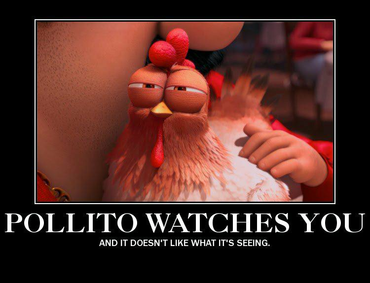

# EthoWatcher

Adicionoado o pastas

src - source code
doc - pasta que contem a documentação

## Arquivos de apoio

Criem arquivos de apoio dentro dos subdiretórios do projeto. Nesse diretório se encontra 2 arquivos de apoio:
- O arquivo "README.md" contém as instruções do projeto EthoWatcherPy
- O arquivo [de como fazer contribuições](como_contribuir.md)  contém as insruções do fluxo de trabalho para a adicão de novas funcionalides no projeto

# Coisas a serem feitas

Para visualisar as [tarefas que precisam ser feitas click aqui](https://github.com/jmarcolan/EthoWatcher/projects/1)

# E Lembree-se !!!

